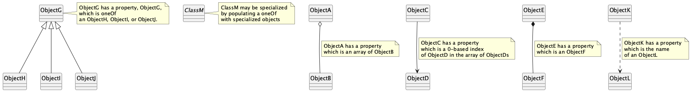
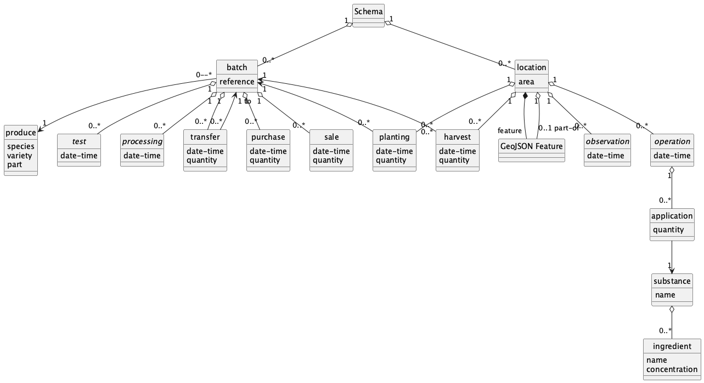

# Introduction to the Schema
It is proposed that data should be shared in JavaScript Object Notation (JSON), so a 
[JSON Schema](crop-production.json) (see 
[json-schema.org](http://json-schema.org)) is being developed.  This schema references other schema files in this repository and a [GeoJSON](http://geojson.org)  schema.

The current version still requires some testing.

## Methodology
The Schema is based on the [UML Model](Model/Documentation.md).  The following describes the general approach taken when mapping from UML to JSON
Schema and any exceptions made.

### Names
JSON names are in lower case only.  Where names are a combination of words, the words are separated by hyphens.

### Classes
Each class that is not a specialization of another class is represented as an `object` of the same name in the definitions, with the exception of: 
- Substance whose schema is in substance.json, because there are likely 
to be a large number of items in the `name` enumeration.  Ingredient is also to be found in `substance.json`.
- Row which is incorporated into the Crop class.

The main part of the schema is an object with two properties, `locations` and `batches` which are arrays of `location` and `batch`, 
respectively.

### Properties
Properties are represented as `properties` of the relevant `object`.

### Generalization and Specialization
For a generalizing class, one of the `properties` has the same name as the class, and references to the specializations are included in the list following a `oneOf` keyword for this property.

Classes which are specializations are represented as objects, with the same name as the specialization class, containing only the properties which are not in the generization, but with an additional property "class", which is a `const` evaluating to the classs name.

### Relationships
An aggregation, or a zero-to-many association becomes a `property` of `type` `array` of the aggregating `object` with the plural of the name of the aggregated objects, or where appropriate their role. 

The only exceptions are: 
- where a class is a child of more than one parent.  For these, one of the `properties` has 
the name of the parent class and has the `type` `integer` which will be used for the zero-based 
index of the linked object in the array of such objects.  Currently, such links are only to batches.
- where the parent class has a unique name, the child class has a property of the same name as the parent class which evaluates to the unique name.

There is currently only one example of a many-to-many relationship in the Model: Operation - Substance which has an association class, Application.  Here, `application` is given a property which is the unique name of the `substance` and `operation` is given a property which is an array of `application` objects.

The above approach to relationships avoids having to maintain links by assigning unique identifiers to objects.

### Types
Types are mapped from the UML model to the JSON schema as follows:

|UML model|JSON schema|
|--------|--------|
|text|`string`|
|number|`number` with the use of `maximum`, `minimum`, `exclusiveMinimum` and `multipleOf` as required in the description|
|datetime|`string` with `format` as `date-time`|
|enumeration|`string` with `enum`|

## GeoJSONhttps://datatracker.ietf.org/doc/html/rfc7946)
The [GeoJSON](https://datatracker.ietf.org/doc/html/rfc7946) Feature object includes the appropriate co-ordinates for the geometry of a location.  It also allows for a null geometry and has an id, both of which are suitable for locations with no co-ordinates.  It is therefore referenced within the location object in the Schema.

## View of structure

A UML diagram is presented below to illustrate the schema, preceded by a key showing how to read the UML with specific relation to the JSON schema.

